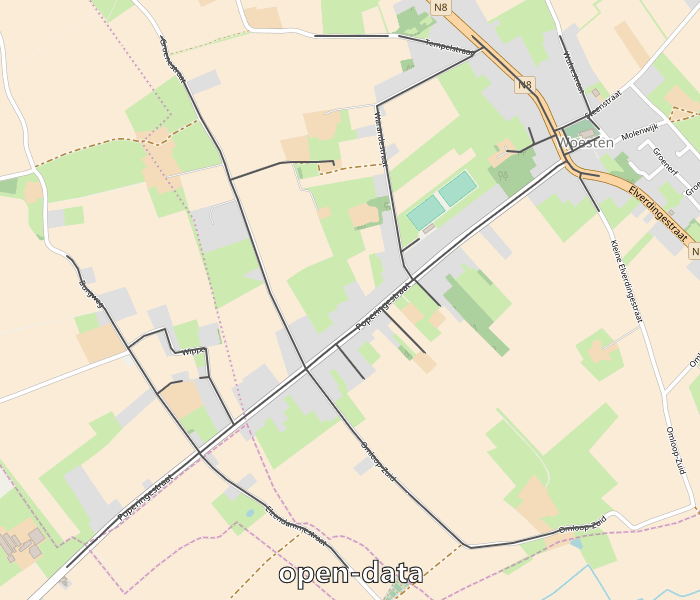

 # Road completion project

These are a collection of tools & scripts to compare road datasets between OSM and external sources. This is based on some stuff mapbox started, <https://www.mapbox.com/blog/osm-qa-tiles/>, and uses their QA tile-based stuff to compare government road datasets to OpenStreetMap. 

It uses the following tools:

- GDAL: to convert shapefiles from local project to WGS84.
- [tippecanoe](https://github.com/mapbox/tippecanoe): a tool from Mapbox to generate vector tiles.
- [tilereduce](https://github.com/mapbox/tile-reduce): another tool from Mapbox (thanks!) to run analysis on the tile data itself.

To produce the following effect:

## Folders

[Docker folder](https://github.com/osmbe/road-completion/tree/master/docker)
    - Contains dockerized difference tool using urbis data

[Old folder](https://github.com/osmbe/road-completion/tree/master/old) 
    - Contains previous none dockerized difference tool using wegenregister data

## Backend-frontend

This repository is for the backend. For the front-end website, please refer to [road-completion-frontend](https://github.com/osmbe/road-completion-frontend)
